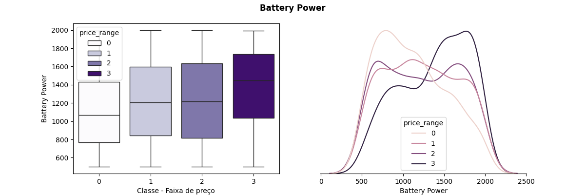
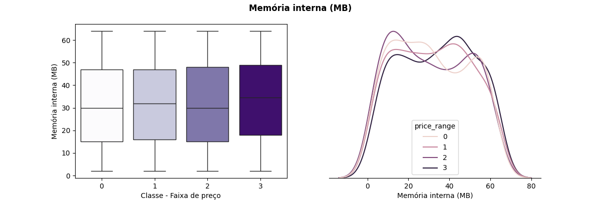
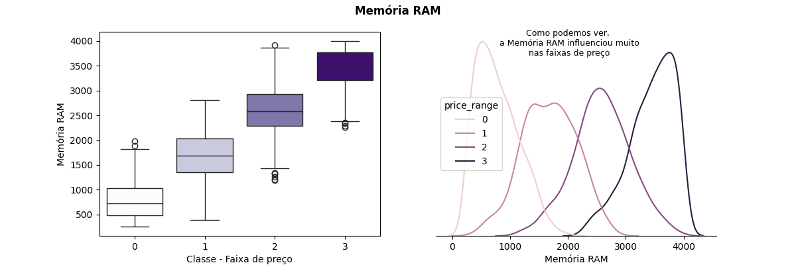
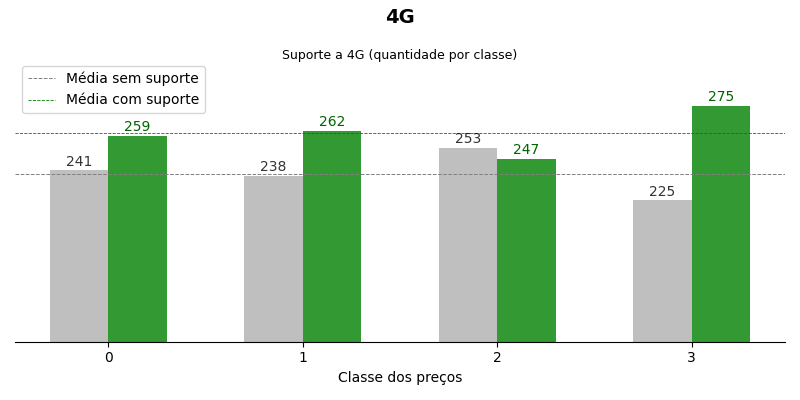
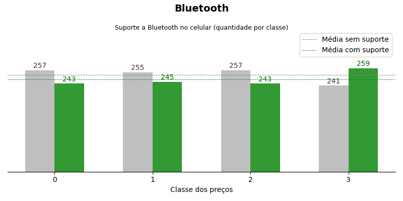
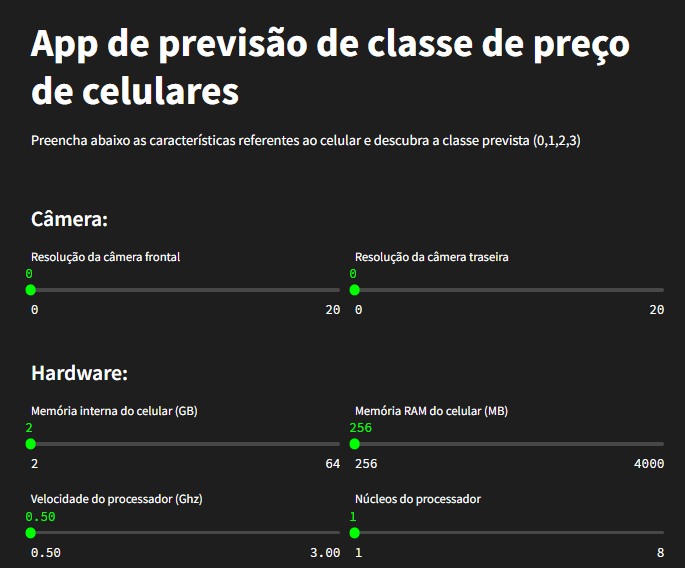
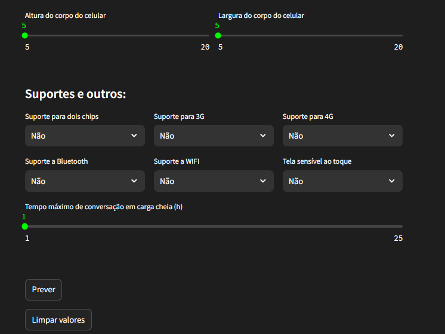

# **Projeto de Classificação - Classes de preços de celulares**

---------------------

## **1. Apresentação**

### **1.1. Possíveis problemas, questões e observações**
- A classificação é útil em diferentes cenários, pois é criada uma "target" que diferencia dados com base em características/features
- Neste cenário a classificação popde ser útil para:
  - Recomendações após uma segmentação de clientes (com base em interesses, cliques, preferências...)
  - Analisar as features mais influentes na classe-alvo (target).
  - Descobrir padrões ocultos nos dados e que influenciam de modo geral.

### **1.2. Contexto das pastas e arquivos do repositório**

- data
  - train.csv e test.csv: dados de treino e teste para o modelo
- images
  - Imagens geradas nas análises de EDA
- notebooks
  - Arquivos .ipynb (cadernos Jupyter), onde o projeto foi feito
- models
  - Pipeline com o pré-processamento e o modelo
- streamlit
  - Imagens relacionadas ao app streamlit
- gitignore
  - Arquivo que contém o que não deve ser versionado
- requirements
  - Todas as bibliotecas utilizadas no projeto, junto com suas versões

### **1.3. O que foi atualizado com relação ao projeto antigo?**

|                     Projeto anterior (1 ano atrás)                  |                                              Projeto atual                                      |
| --------------------------------------------------------------------|-------------------------------------------------------------------------------------------------|
| Código não versionado com Git                                       |   Código versionado com o Git, permitindo voltar a estágios anteriores                          |
| Apenas um notebook para todas as etapas (EDA e Machine Learning     |   Pastas e arquivos organizados de acordo com sua finalidade                                    |
| Sem pipeline e exportação do modelo                                 |   Pipeline completo exportado com o joblib, para utilizar no Streamlit                          |
| Interação apenas do notebook                                        |   App Streamlit para inserir as features e prever a classe do preço                             |
| Sem a pasta "images" com os gráficos                                |   Imagens dos gráficos disponibilizadas nas pastas "images" e "streamlit"                       |

### **1.4. Fonte das bases de dados**

link: https://www.kaggle.com/datasets/iabhishekofficial/mobile-price-classification

---

## **2. Análise Exploratória de dados**

### **2.1. Contexto:**
- Temos dois arquivos no formato csv (train e test), que possuem características referentes a dispositivos móveis, como:
  - Dimensões físicas
  - Características de hardware
  - Suporte a tecnologias
  - Fatores relacionados a celulares, de um modo geral.
- Com isso, a missão é, após esses dados terem sido coletados, analisar as colunas de maiores pesos, explorar à fundo, e criar um modelo capaz de prever uma classe de preços, tornando-se um problema de classificação.

### **2.2 Analisando features numéricas contínuas:**

#### **2.2.1. Battery Power**

Como podemos ver, há uma tendência de crescimento nos valores da feature "battery_power". Podemos notar isso olhando as medianas por exemplo (linha central da caixa), na classe 0 ela beira o valor de 1100, já na classe 3 ela beira 1400. Porém, devemos ter cuidado, pois como mostra o gráfico de caixa, independente da classe, os valores podem ser altos ou baixos. Mas, há sim uma leve correlação positiva.

#### **2.2.2. Memória interna**

Analisando esses gráficos, podemos dizer que dentro dessa amostra coletada, não há grandes diferenças, como podemos ver nos gráficos de caixa, inclusive os quartis se assemelham bastante.

#### **2.2.3. Memória RAM**

Aqui temos um exemplo muito claro de correlação altamente positiva. Como podemos ver, não só as medianas, mas também os outros quartis se diferen muito conforme a classe de preços muda. Ou seja, essa feature possui um peso extremamente considerável na classe-alvo.

- Analisando o gráfico acima, podemos dizer que:
  - A classe 0 concentra valores de RAM entre 500 e 1000
  - A classe 1 concentra valores de RAM entre 1400 e 2000
  - A classe 2 concentra valores de RAM entre 2200 e 3000
  - A classe 3 concentra valores de RAM acima de 3200
 
Obviamanete há exceções, pois vários outros fatores são levados em conta no preço final.

---

### **2.3. Analisando features categóricas binárias**

#### **2.3.1. 4G**

Conseguimos ver algumas diferenças conforme as classes mudam. Há um comportamento interessante, no mínimo curioso nesses dados:
- Há mais celulares com 4G na classe 0 do que na classe 1 e 2.

#### **2.3.2. Bluetooth**

- As classes estão equilibradas de modo geral
- A classe 3 possui mais celulares com bluetooth

---

### **3. Modelo de Machine Learning**

- Realizei normalização e padronização em algumas colunas
- Criei um modelo de Regressão Logística
- Fiz a validação cruzada
- Juntei tudo isso em um pipeline
- Visualizamos as probabilidades de escolha das classes com o predict_proba

---

### **4. Criando interface interativa com o Streamlit**

#### **4.1. Inicio do app:**

Contém campos referentes as features para a previsão do modelo

#### **4.2. Previsão:**

No final da tela há o botão de previsão, que quando apertado, realiza a predição com os dados inseridos pelo usuário. Os campos preenchidos junto com a classe predita são enviados para um arquivo csv, junto com a data e hora do momento que a previsão foi feita

